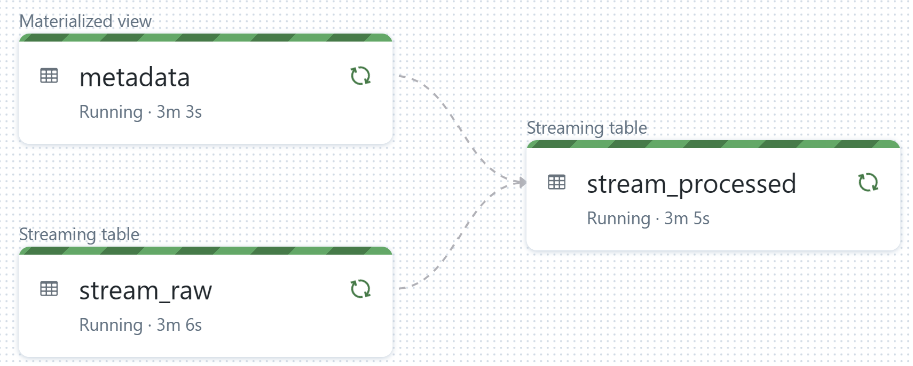

# portable-etl

## Why?
Workload portability is important to manufacturing customers, as it allows them to operate solutions across different environments without the need to re-architect or re-write large sections of code. They can easily move from the Edge to the cloud, depending on their specific requirements. It also enables them to analyze and make real-time decisions at the source of the data and reduces their dependency on a central location for data processing. [Apache Spark](https://spark.apache.org/docs/latest/)'s rich ecosystem of data connectors, availability in [the cloud](https://azure.microsoft.com/en-us/products/databricks) and the Edge ([Docker](https://hub.docker.com/r/apache/spark-py) & [Kubernetes](https://spark.apache.org/docs/latest/running-on-kubernetes.html)), and a [thriving open source community](https://github.com/apache/spark) makes it an ideal candidate for portable ETL workloads. In this sample we'll showcase an E2E data pipeline leveraging [Spark's Structured Streaming](https://spark.apache.org/docs/latest/structured-streaming-programming-guide.html#overview) capabilities.

## Edge
In the Edge version, we provision and orchestrate everything with `Docker Compose`. The pipeline begins with [Azure IoT Device Telemetry Simulator](https://github.com/Azure-Samples/Iot-Telemetry-Simulator) sending synthetic Time Series data to a [Confluent Community Kafka Server](https://docs.confluent.io/platform/current/platform-quickstart.html#ce-docker-quickstart). A PySpark app then processes the Time Series, applies some metadata and writes the aggregated results to a SQL DB hosted in [SQL Server 2022 Linux container](https://learn.microsoft.com/en-us/sql/linux/quickstart-install-connect-docker?view=sql-server-ver16&pivots=cs1-bash). To validate that the E2E Edge pipeline is working correctly, we can execute the script `smoke-test.sh`.

    

## Cloud
In the Cloud version, we provision all infrastructure with Terraform.

**Note:** Prior to running `terraform apply` you must ensure the wheel `common_lib/dist/common_lib-*.whl` exists locally by executing `sudo python3 -m build ./common_lib`.

The IoT Telemetry Simulator is hosted in [Azure Container Instances](https://azure.microsoft.com/en-us/products/container-instances). It sends generated data to a Kafka head, [exposed through Azure Event Hubs](https://learn.microsoft.com/en-us/azure/event-hubs/azure-event-hubs-kafka-overview).
The rest of the ETL workload is orchestrated using a combination of a [Delta Live Tables](https://learn.microsoft.com/en-us/azure/databricks/workflows/delta-live-tables/) Pipeline and a [Databricks Job](https://learn.microsoft.com/en-us/azure/databricks/workflows/jobs/jobs). The DLT Pipeline is responsible for reading and aggregating the data from sources, while the Databricks job, streams the aggregated output to an [Azure SQL DB](https://azure.microsoft.com/en-us/products/azure-sql/database/). Key point to note here is that the stream processing logic is shared between the Edge and Cloud through the `common_lib` [Wheel](https://pypi.org/project/wheel/).

    

### Delta Live Tables Pipeline

    

## Codespaces
This solution supports GitHub Codespaces through the VS Code Dev Containers. The minimum required machine type configuration is `4-core`.