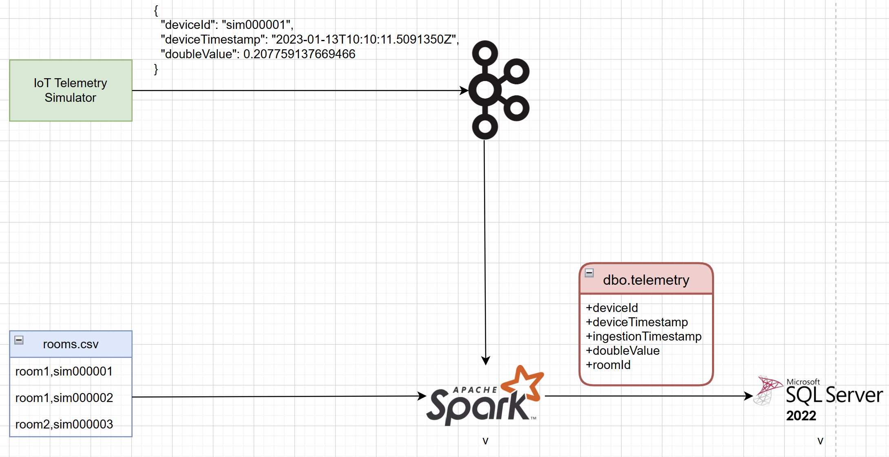
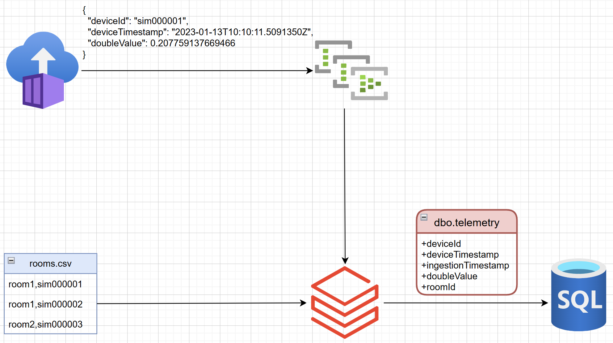
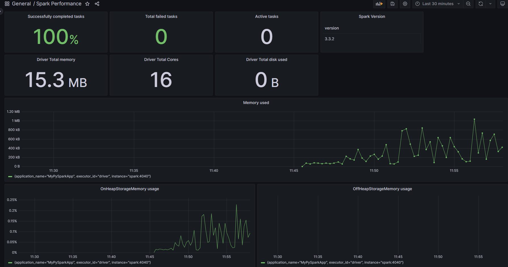

# portable-etl

## Why?
Workload portability is important to manufacturing customers, as it allows them to operate solutions across different environments without the need to re-architect or re-write large sections of code. They can easily move from the Edge to the cloud, depending on their specific requirements. It also enables them to analyze and make real-time decisions at the source of the data and reduces their dependency on a central location for data processing. [Apache Spark](https://spark.apache.org/docs/latest/)'s rich ecosystem of data connectors, availability in [the cloud](https://azure.microsoft.com/en-us/products/databricks) and the Edge ([Docker](https://hub.docker.com/r/apache/spark-py) & [Kubernetes](https://spark.apache.org/docs/latest/running-on-kubernetes.html)), and a [thriving open source community](https://github.com/apache/spark) makes it an ideal candidate for portable ETL workloads. 

## What?
In this sample we'll showcase an E2E data pipeline leveraging Spark's data processing capabilities.

## How?
### Edge
In the Edge version, we provision and orchestrate everything with [Docker Compose](https://docs.docker.com/compose/). The pipeline begins with [Azure IoT Device Telemetry Simulator](https://github.com/Azure-Samples/Iot-Telemetry-Simulator) sending synthetic Time Series data to a [Confluent Community Kafka Server](https://docs.confluent.io/platform/current/platform-quickstart.html#ce-docker-quickstart). A PySpark app then processes the Time Series, applies some metadata and writes the enriched results to a SQL DB hosted in [SQL Server 2022 Linux container](https://learn.microsoft.com/en-us/sql/linux/quickstart-install-connect-docker?view=sql-server-ver16&pivots=cs1-bash).

    

### Cloud
In the Cloud version, we provision all infrastructure with [Terraform](https://registry.terraform.io/providers/hashicorp/azurerm/latest/docs).

**Note:** Prior to running `terraform apply` you must ensure the [wheel](https://wheel.readthedocs.io/en/stable/) `./src/common_lib/dist/common_lib-*.whl` exists locally by executing `sudo python3 -m build ./src/common_lib`.

The IoT Telemetry Simulator is hosted in [Azure Container Instances](https://azure.microsoft.com/en-us/products/container-instances). It sends generated data to a Kafka broker, [exposed through Azure Event Hubs](https://learn.microsoft.com/en-us/azure/event-hubs/azure-event-hubs-kafka-overview).
The ETL workload is represented in a [Databricks Job](https://learn.microsoft.com/en-us/azure/databricks/workflows/jobs/jobs). This job is responsible for reading and enriching the data from sources and store the final output to an [Azure SQL DB](https://azure.microsoft.com/en-us/products/azure-sql/database/). Key point to note here is that the data processing logic is shared between the Edge and Cloud through the `common_lib` Wheel.

    

## NFRs

### Tests
- To validate that the E2E Edge pipeline is working correctly, we can execute the script `smoke-test.sh`. This script will send messages using the IoT Telemetry Simulator and then query the SQL DB to ensure the messages were processed correctly.
- Unit tests are available for the `common_lib` Wheel in PyTest.
- Both type of tests are also executed in the CI pipeline.

### Observability
The Edge version of the solution also deploys additional containers for [Prometheus](https://prometheus.io/) and [Grafana](https://grafana.com/). The Grafana dashboard below, relies on the [Spark 3.0 metrics](https://spark.apache.org/docs/3.0.0/monitoring.html) emitted in the Prometheus format.

    

### Inner Dev Loop
[GitHub Codespaces](https://github.com/features/codespaces) are supported through the [VS Code Dev Containers](https://code.visualstudio.com/docs/devcontainers/containers). The minimum required [machine type](https://docs.github.com/en/codespaces/customizing-your-codespace/changing-the-machine-type-for-your-codespace) configuration is `4-core`.

## Team
- [Alexander Gassmann](https://github.com/Salazander)
- [Magda Baran](https://github.com/MagdaPaj)
- [Hassaan Ahmed](https://github.com/syedhassaanahmed)