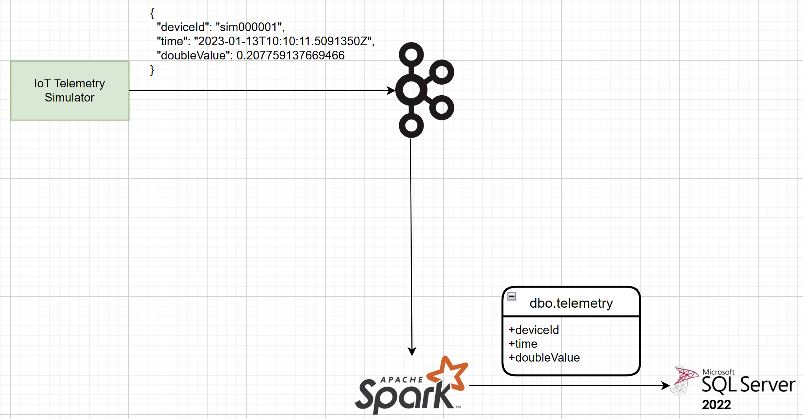

# spark-etl-edge

A containerized E2E data pipeline which showcases [Spark's Structured Streaming](https://spark.apache.org/docs/latest/structured-streaming-programming-guide.html#overview) capabilities.

## Components
- [Azure IoT Device Telemetry Simulator](https://github.com/Azure-Samples/Iot-Telemetry-Simulator)
- [Confluent Community Docker Image for Apache Kafka](https://docs.confluent.io/platform/current/platform-quickstart.html#ce-docker-quickstart) 
- [Apache PySpark Docker Image](https://hub.docker.com/r/apache/spark-py)
- [SQL Server 2022 Linux container image](https://learn.microsoft.com/en-us/sql/linux/quickstart-install-connect-docker?view=sql-server-ver16&pivots=cs1-bash)

## Architecture

    

## Smoke Test
To validate that the E2E pipeline is working correctly, you can execute the script `smoke-test.sh`
